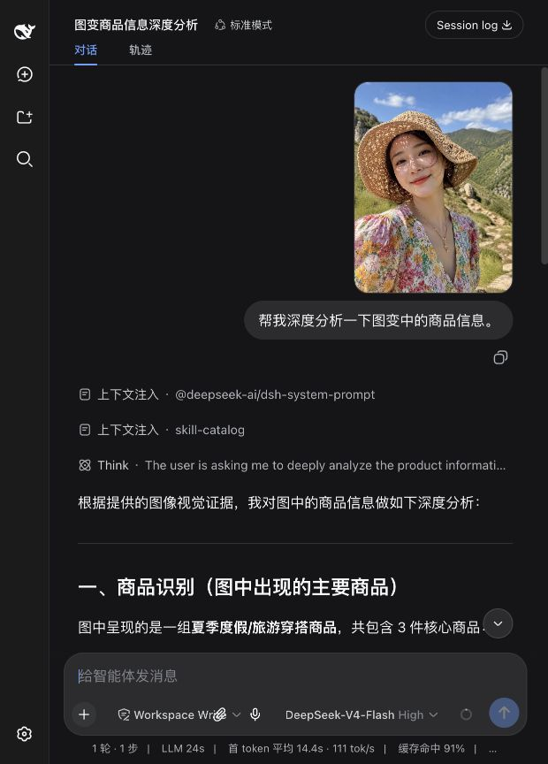

# DeepSeek Harness 多模态路由器

[English](README.md)

这是一个面向 [DeepSeek Harness](https://github.com/deepseek-ai/deepseek-harness) 的零配置多模态插件。它为 Agent 提供图片理解，并在模型与本地音色运行时均就绪时开放完整的实时语音对话。

## 为什么需要 Multimodal Router？

DeepSeek 继续负责推理、规划和操作；Multimodal Router 把图片感知交给本地或显式配置的多模态模型，再将文字证据返回给 DeepSeek。默认链路只使用本机模型，不需要填写模型名或端口。

## 界面预览

同一个对话界面会保留上传的原图、用户问题和模型回答，方便核对视觉分析结果。



## 功能

- 根据 Ollama 模型元数据零配置发现视觉模型
- 提供图片附件按钮，并支持拖拽和剪贴板图片，自动调用本地视觉模型
- 根据模型能力自动显示语音对话按钮：本地增量识别结果同步到输入框、停顿自动发送、回答自动朗读
- Gemma 4 E2B、E4B、12B 默认启用图片与音频；26B、31B 仅启用图片
- 会话中保留原图缩略图，并按内容哈希归档到本地目录
- 本地优先，默认禁止远程自动回退
- 支持多个带优先级的 Provider
- 支持 Ollama 与 OpenAI-compatible 视觉接口
- 支持任务显式选择 Provider
- 支持 PNG、JPEG、WebP、GIF 和图片 Data URL
- 提供通用描述、OCR、UI、图表、代码/错误截图预设
- API Key 仅从环境变量读取，不进入插件配置

## 环境要求

- Node.js 22.19+
- DeepSeek Harness `0.1.0-rc.6`
- 默认链路需要：运行于 `127.0.0.1:11434` 的 Ollama 和至少一个多模态模型
- 高质量回答朗读（可选）：运行于 `127.0.0.1:8000` 的 MLX-Audio

## 安装 Qwen3-TTS（Apple Silicon）

Qwen3-TTS 不通过 Ollama 安装。本项目把 MLX-Audio 声明为可选运行时依赖，并提供一键安装命令：

```bash
brew install uv
npx @hanchn/dsh-multimodal-router setup-tts
```

安装命令会先询问是否下载，默认选项为“不下载”，不会强制安装。无人值守安装可显式使用 `--enable` 或 `--disable`。选择启用后不需要手动启动第二个服务：Multimodal Router 会随 DSH 自动启动和关闭 MLX-Audio。第一次语音回答会自动下载默认模型 `mlx-community/Qwen3-TTS-12Hz-0.6B-CustomVoice-8bit`（约 2GB）到 Hugging Face 本机缓存。默认使用温暖女声 `Serena`。可以在插件配置的 `tts.voice` 中改为 `Vivian`、`Dylan`、`Uncle_Fu` 或 `Eric`。

排障时可以运行 `npx @hanchn/dsh-multimodal-router check-tts`；只有手动排障才需要直接执行 `mlx_audio.server --host 127.0.0.1 --port 8000`。

如果用户选择不下载，或者 MLX-Audio 未就绪，插件不会显示语音对话入口，也不会退回浏览器/操作系统音色；图片功能仍可正常使用。

## 安装

在本仓库目录执行：

```bash
cp .env.example .env
# 只在本机编辑 .env 并填写 DEEPSEEK_API_KEY，切勿提交 .env。
npx @deepseek-ai/dsh@0.1.0-rc.6 plugin --profile web add .
npx @deepseek-ai/dsh@0.1.0-rc.6 web
```

打开 `http://127.0.0.1:3080`，点击输入框工具栏的回形针按钮选择图片，也可以拖入图片或按 `Cmd/Ctrl+V` 粘贴，然后直接提问。Multimodal Router 会先分析附件，再把文字结果交给不支持视觉的 DeepSeek 主模型。

如果本机同时存在支持音频的模型与可用的 Qwen3-TTS，输入框工具栏会自动出现语音对话按钮。点击后开始倾听，本地增量识别约每 1.5 秒触发一次并把结果同步到输入框，检测到停顿后自动完成最后一段转写并发送；模型回答结束后由本机 Qwen3-TTS 朗读，然后继续倾听下一轮。朗读过程中点击按钮可打断并立即讲话，再次点击可结束语音对话。Gemma 4 单段音频最长 30 秒。原始声音只发送给本机 Ollama，不会保存到项目目录。

Gemma 4 的音频能力是“声音输入、文字输出”，不会直接生成声音。回答朗读由本机 MLX-Audio/Qwen3-TTS 完成；默认禁用浏览器/操作系统的 `speechSynthesis` 回退。

## Gemma 4 能力识别

插件优先读取 Ollama `/api/show` 返回的 `capabilities`，并针对元数据不完整的模型包使用以下安全回退：

| 模型 | 图片 | 音频 |
| --- | --- | --- |
| Gemma 4 E2B / E4B / 12B | 支持 | 支持 |
| Gemma 4 26B / 31B | 支持 | 不支持 |

26B 与 31B 会明确移除误报的音频能力；其他模型只采用运行时实际声明的能力。

实时语音转写会优先选择 E2B，其次 E4B，最后 12B。开启实时语音后，自动图片分析复用同一个模型，避免 16GB 设备在视觉模型和语音模型之间反复换入换出。

对于文件系统中的图片，也可以继续显式调用工具：

```text
使用 inspect_image 分析 /绝对路径/screenshot.png，然后解释这个 UI 的问题。
```

## 零配置工作方式

默认 Provider 调用 Ollama `/api/tags` 获取模型，再使用 `/api/show` 检查每个候选。插件优先采用运行时声明的 `capabilities`；仅对 Gemma 4 已知规格使用严格的型号回退规则。

## 多 Provider 配置

在 DSH profile patch 中修改插件配置：

```yaml
- id: multimodal-router
  name: '@hanchn/dsh-multimodal-router'
  config:
    automaticAttachments: true
    archiveDirectory: .dsh-multimodal-router/images
    cacheDirectory: .dsh-multimodal-router/cache
    discoveryCacheMs: 300000
    resultCacheMs: 3600000
    resultCacheMaxEntries: 64
    ollamaKeepAlive: 2m
    ollamaIdleUnloadMs: 60000
    maxVisionTokens: 256
    providers:
      - id: local-auto
        type: ollama
        baseUrl: http://127.0.0.1:11434
        model: auto
        apiKeyEnv: ''
        priority: 100
      - id: company-vlm
        type: openai-compatible
        baseUrl: https://vision.example.com/v1
        model: qwen-vl
        apiKeyEnv: COMPANY_VLM_KEY
        priority: 50
    allowRemoteFallback: false
    timeoutMs: 180000
    maxImageBytes: 20971520
    realtimeAudio: true
    transcriptionLocale: zh-CN
    audioChunkMs: 1500
    maxAudioSeconds: 30
    maxAudioBytes: 10485760
    tts:
      enabled: true
      autoStart: true
      baseUrl: http://127.0.0.1:8000
      model: mlx-community/Qwen3-TTS-12Hz-0.6B-CustomVoice-8bit
      voice: Serena
      responseFormat: wav
      browserFallback: false
      maxTextCharacters: 8000
      keepAliveMs: 300000
```

只有在允许图片自动离开本机时，才应设置 `allowRemoteFallback: true`。任务也可以通过 Provider `id` 显式选择某个已配置后端，此时不受自动回退策略影响。

启用 `automaticAttachments: true` 后，插件会先向 DSH 的请求准入层声明“已路由的视觉能力”，再通过附件服务读取当前会话授权的图片。原始消息和缩略图保持不变；只有真正发往 Provider 的请求会在适配器边界被临时转换为格式化文字。设为 `false` 可关闭自动处理，只保留显式的 `inspect_image` 工具。

`archiveDirectory` 会为每张自动处理的图片保存一份按内容寻址的本地副本。默认目录 `.dsh-multimodal-router/images` 已被 Git 忽略；设为空字符串可关闭额外归档，聊天预览仍由 DSH 自身的附件存储提供。

模型发现结果默认缓存 5 分钟。自动附件分析使用稳定的“图片内容 + 基础视觉分析”键，同一张图片换一种问法也能复用；结果同时保存在内存和 `.dsh-multimodal-router/cache`，服务重启后仍可命中，默认有效 1 小时。内存层最多保留 64 条结果，避免缓存自身无限增长。开启实时语音时，图片与语音复用同一个 E2B/E4B 模型；每次本地推理完成后，空闲 60 秒会主动卸载 Gemma，而不是依赖 Ollama 较长的默认驻留时间。

`realtimeAudio` 控制实时语音功能；`transcriptionLocale` 默认固定为 `zh-CN`，中文识别结果统一转换成简体，不再受浏览器区域设置影响；`audioChunkMs` 默认每 1.5 秒触发一次增量转写，识别结果持续写入输入框；`maxAudioSeconds` 最大为 30；`maxAudioBytes` 限制单次传给本机 Ollama 的 WAV 数据大小。没有兼容模型或 TTS 未就绪时，语音入口自动隐藏。

`tts` 配置本地回答朗读服务。默认连接并自动管理 MLX-Audio 的 8000 端口，使用 Qwen3-TTS 0.6B 8-bit 和 `Serena`；`enabled` 是总开关，`autoStart` 控制进程托管。点击麦克风时会提前解锁浏览器音频通道；界面会区分“正在生成语音”和真正的“正在朗读”，播放失败会显示原因。TTS 模型默认空闲 5 分钟后从 MLX-Audio 卸载；`browserFallback` 默认关闭。

## 隐私与安全

- 除非开启 `allowRemoteFallback`，自动路由只使用本地 Provider。
- Ollama 地址必须是通过 HTTP 访问的 `localhost` 或 `127.0.0.1`。
- 远程密钥只读取 `apiKeyEnv` 指定的环境变量。
- 真实密钥只能保存在已忽略的本地 `.env`；仓库只提交值为空的 `.env.example`。
- 不要把 API Key 写入 `cordis.patch.yml`、提示词、Issue、日志、截图或 Git 提交。
- 开启远程回退意味着图片数据可能发送给所配置的远程 Provider；启用前请确认其隐私政策。
- 上传图片只通过 DSH 附件服务读取，内部存储路径不会暴露给模型。
- 归档文件名只包含 SHA-256 摘要和图片扩展名，不包含原始文件名。
- 只有 Agent 调用 `inspect_image` 时才会读取文件系统图片路径。
- 每次结果都会记录 Provider 和模型，便于审计与复现。

### 本地密钥配置

```bash
cp .env.example .env
chmod 600 .env
```

然后只在本机编辑 `.env`：

```dotenv
DEEPSEEK_API_KEY=
```

仓库的 `.gitignore` 会排除 `.env` 和 `.env.*`，并仅允许提交值为空的 `.env.example` 模板。

## 工具参数

```text
inspect_image({
  image_path: "/path/image.png",
  prompt: "这个 UI 有什么问题？",
  mode: "ui",
  provider: "local-auto"
})
```

`mode` 支持 `auto`、`describe`、`ocr`、`ui`、`chart` 和 `code`。`prompt`、`mode`、`provider` 均可省略。

## 故障排查

- **没有发现视觉模型：**运行 `ollama list`，再确认 `/api/show` 返回 `.vision.` 元数据。
- **无法连接 Ollama：**确认 `curl http://127.0.0.1:11434/api/tags` 成功。
- **缺少远程密钥：**在启动 DSH 前导出 `apiKeyEnv` 配置的环境变量。
- **调用超时：**增大 `timeoutMs`；模型首次加载通常较慢。
- **首张图片较慢：**本地模型装载和推理需要时间。推理请求使用 2 分钟 `keep_alive`，插件会在最后一次本地推理完成 60 秒后主动卸载；重复图片优先使用结果缓存。
- **中文转写出现繁体：**确认 `transcriptionLocale: zh-CN` 并重启 DSH；服务端会在写入输入框前统一转换为简体。
- **显示朗读但没有声音：**先确认状态已从“正在生成语音”切换为“正在朗读”；运行 `npx @hanchn/dsh-multimodal-router check-tts` 检查本地 TTS。
- **图片格式不支持：**转换为 PNG、JPEG、WebP 或 GIF。
- **主模型仍提示不支持视觉：**确认 `automaticAttachments: true`，修改插件后重启 DSH，并检查 `multimodal-router` 已挂载。

## 开发

```bash
pnpm install
pnpm check
```

DeepSeek Harness 当前仍处于 Developer Preview，插件接口可能发生破坏性变化。本版本针对 `0.1.0-rc.6`。

## 许可证

MIT
